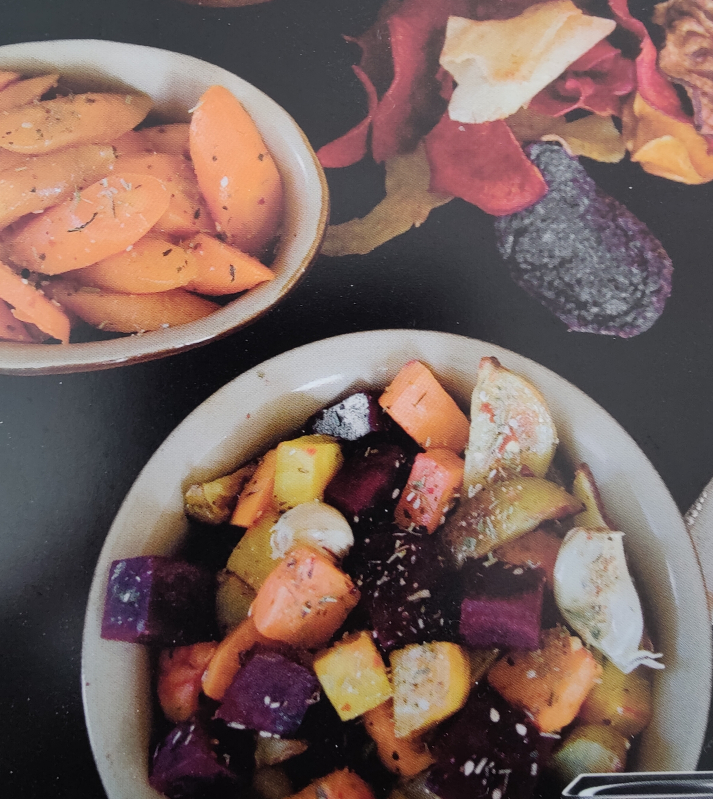

title=Bagte rodfrugter med Happy Roots krydderi
date=2024-10-03
type=page
tags=bage
status=published
category=tilbehoer
~~~~~~
= Bagte rodfrugter

== Ingredienser

500 Rodfrugter i mundrette bidder (fx, kartofter, rødbeder guelrødder, selleri, pastinak)

olivenolie

1/2 tsk. salt

1 tsk _Mill & Mortar_ Happy Roots

== Fremgangsmåde

Skær rodfrugterne i mund rette stykker 

vend dem i olivenolie, salt og Happy Roots

Bag midt i oven ved 200 grader til de er møre, ca. 45 minnuter 

TIP: rødbederne var specielt gode